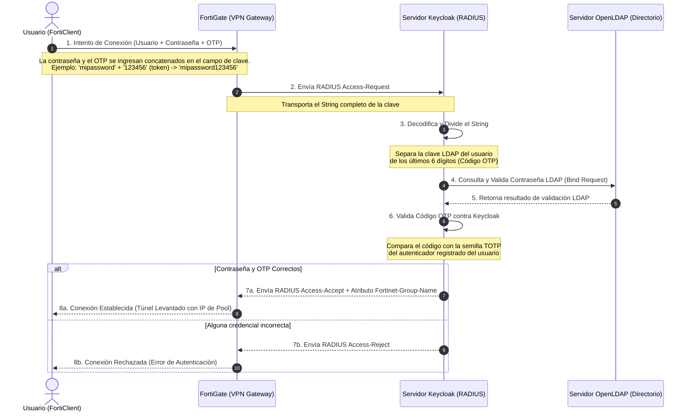
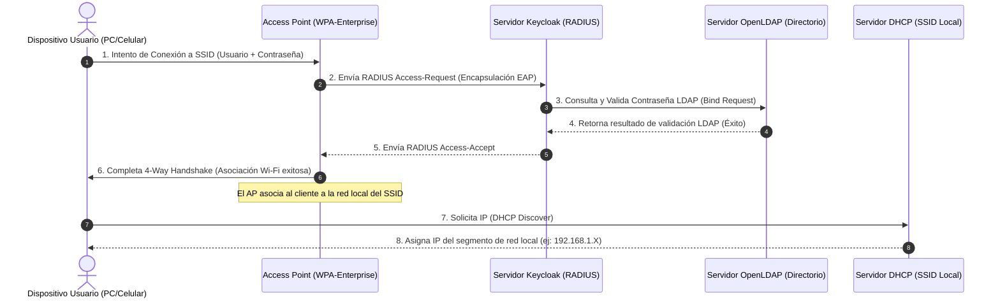
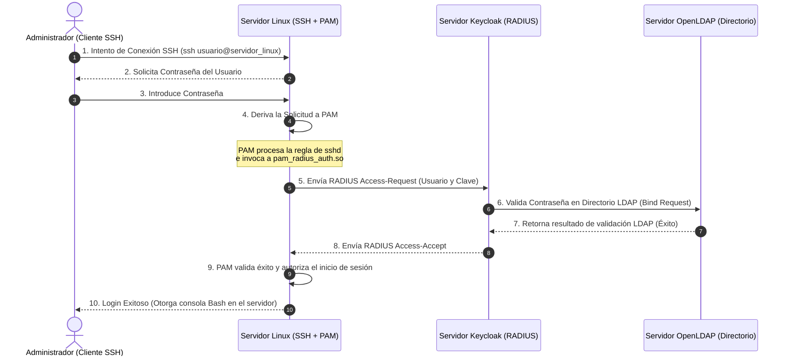

# Documentación Técnica del Servidor AAA (Keycloak RADIUS & OpenLDAP)

Este documento contiene toda la información técnica, credenciales, diagramas e instrucciones necesarias para que un administrador de redes pueda gestionar, configurar e integrar este servidor AAA centralizado en la infraestructura de red.

---

## 1. Resumen de la Arquitectura del Servidor

El servidor está diseñado para centralizar la autenticación, autorización y contabilidad (AAA) de la red, uniendo el protocolo LDAP y el protocolo RADIUS:

```mermaid
graph TD
    subgraph Servidor AAA (VM Keycloak/LDAP)
        LDAP[Directorio OpenLDAP - Puerto 389]
        LAM[LDAP Account Manager - Web Puerto 80]
        KC[Keycloak IAM - Web Puerto 8080]
        RAD[Keycloak RADIUS Plugin - Puertos UDP 1812/1813]
        
        LAM -->|Gestiona| LDAP
        KC -->|Sincroniza Usuarios| LDAP
        RAD -->|Obtiene Tokens y Roles| KC
    end

    subgraph Clientes de Red (NAS)
        FG[FortiGate Firewall / VPN]
        AP[Access Points Wi-Fi Enterprise 802.1X]
        SRV[Servidores Linux SSH]
    end

    FG -->|RADIUS Auth/Acct| RAD
    AP -->|RADIUS WPA-Enterprise| RAD
    SRV -->|RADIUS PAM Auth| RAD
```

---

## 2. Direccionamiento IP y Credenciales de Acceso

### 2.1. Acceso a la Máquina Virtual (Consola / SSH)
*   **IP Original (KVM)**: `192.168.122.151` (Si se importa a Proxmox, obtendrá IP local vía DHCP o IP estática según configuración).
*   **Usuario SSH**: `cplaza`
*   **Contraseña**: `Mquest`
*   **Acceso Sudo**: Permitido sin contraseña (`sudo su` directo).

### 2.2. Interfaz Web de Gestión de Usuarios (OpenLDAP / LAM)
*   **URL Local (en la VM)**: `http://192.168.122.151/lam/`
*   **URL Re-dirigida (desde Host HP)**: `http://192.168.1.120:9091/lam/`
*   **Servidor de Conexión (LDAP Server)**: `localhost`
*   **Contraseña de LAM (Administrador)**: `adminpassword`
*   **Base DN**: `dc=mquest,dc=local`

### 2.3. Consola Web de Keycloak
*   **URL Local (en la VM)**: `http://192.168.122.151:8080`
*   **URL Re-dirigida (desde Host HP)**: `http://192.168.1.120:9090`
*   **Usuario de Consola**: `admin`
*   **Contraseña**: `admin`

### 2.4. Secreto Compartido de RADIUS (RADIUS Secret)
Este secreto debe coincidir en cualquier dispositivo de red (FortiGate, Access Point, Switch, Servidor Linux) que se conecte a este servidor:
*   **RADIUS Client Secret**: **`fortigateradiussecret`**
*   **Puerto de Autenticación**: `1812 (UDP)`
*   **Puerto de Contabilidad (Accounting)**: `1813 (UDP)`

---

## 3. Gestión de Usuarios y Grupos (Para el Administrador)

Toda la creación de usuarios y contraseñas se realiza a través de **LDAP Account Manager (LAM)**. Keycloak está configurado con una tarea que sincroniza periódicamente los usuarios desde LDAP a su base de datos.

### 3.1. Crear un Nuevo Usuario
1. Entra a LAM (`http://<IP-SERVER>/lam/`).
2. Ve a la pestaña **Users**.
3. Haz clic en **New User**:
   * **First Name / Last Name**: Datos del usuario.
   * **User Name (uid)**: Identificador único (ej: `jdoe`). Este es el nombre que usará para ingresar a la VPN, Wi-Fi o SSH.
   * **Password**: Establece la contraseña del usuario.
4. En la pestaña **Groups**, asocia el usuario a un grupo de LDAP si es necesario (ej: `VPNGroup`).
5. Haz clic en **Save**.

### 3.2. Descripción de las Aplicaciones de Directorio (OpenLDAP & LAM)

El ecosistema cuenta con dos componentes fundamentales para el almacenamiento y administración del directorio de identidades:

*   **OpenLDAP (slapd)**: Es el motor del directorio de base de datos jerárquico. Utiliza esquemas estandarizados para almacenar las cuentas y grupos. Toda la información de usuarios se organiza en la estructura de árbol bajo el sufijo base `dc=mquest,dc=local`. 
    *   **Usuarios**: Almacenados en la unidad organizativa `ou=people,dc=mquest,dc=local` con clases de objeto `posixAccount`, `inetOrgPerson` y `shadowAccount`.
    *   **Grupos**: Almacenados en `ou=groups,dc=mquest,dc=local` con clases de objeto `posixGroup` para definir la pertenencia a grupos (como `VPNGroup`).
*   **LDAP Account Manager (LAM)**: Es una aplicación web basada en PHP que corre sobre el servidor web Apache en la misma VM. Su propósito es proveer una interfaz de administración visual amigable. Permite realizar operaciones CRUD (crear, leer, actualizar, borrar) en OpenLDAP sin requerir la edición manual de archivos LDIF o comandos de terminal de LDAP.

---

## 4. Guía de Integración con Dispositivos de Red

### 4.1. Integración con FortiGate (VPN y Políticas de Acceso)

#### A. Definición del Servidor RADIUS en FortiGate CLI
Para que FortiGate consulte a este servidor Keycloak, ingresa la siguiente configuración en la consola del firewall:
```fortinet
config user radius
    edit "Keycloak-RADIUS"
        set server "192.168.122.151" # Reemplazar por la IP final del servidor AAA
        set secret "fortigateradiussecret"
        set auth-type pap
        # IMPORTANTE: Desactivar la verificación estricta de Message-Authenticator 
        # (mitigación Blast-RADIUS) para compatibilidad con el módulo Keycloak
        set require-message-authenticator disable
    next
end
```

#### B. Mapeo de Políticas de Navegación por Grupos (Dynamic Group Policies)
Para aplicar filtros de contenido o reglas de cortafuegos distintas según el rol del usuario (por ejemplo, restringir el acceso a servidores críticos a ciertos grupos o aplicar filtros de navegación web más estrictos):

1. **Configurar el Mapper en Keycloak**:
   * Entra a Keycloak -> Realm -> **Radius** -> **Radius Mappers**.
   * Crea un mapper tipo **Group Member Mapper**.
   * **Radius Attribute**: `Fortinet-Group-Name` (Vendor ID: `12356`, Attribute ID: `1`).
   * **Keycloak Group**: `/VPNGroup`
   * **Value**: `VPNGroup`
2. **Definir el Grupo en FortiGate**:
   Asocia el grupo devuelto por RADIUS a un grupo interno de FortiGate:
   ```fortinet
   config user group
       edit "VPN-RADIUS-Users"
           set member "Keycloak-RADIUS"
           config match
               edit 1
                   set server-name "Keycloak-RADIUS"
                   set group-name "VPNGroup"  # Debe coincidir exactamente con el valor devuelto por Keycloak
               next
           end
       next
   end
   ```
3. **Crear Políticas de Cortafuegos específicas**:
   En FortiGate puedes crear políticas separadas donde el origen de tráfico (Source) requiera pertenecer a este grupo:
   ```fortinet
   config firewall policy
       edit 10
           set name "Acceso-Servidores-Finanzas"
           set srcintf "ssl.root" # o dialup-vpn
           set dstintf "port2"
           set action accept
           set srcaddr "all"
           set dstaddr "Servidores-Finanzas"
           set groups "VPN-RADIUS-Users" # Solo permite a los usuarios en VPNGroup
           set schedule "always"
           set service "ALL"
       next
    end
    ```

#### C. Flujo de Conexión VPN con Segundo Factor (2FA / OTP)
Para robustecer la seguridad, el ecosistema admite la autenticación multifactor (MFA). El flujo de autenticación y validación del token de un solo uso (OTP) se realiza de la siguiente manera:



---

### 4.2. Integración con Access Points (Wi-Fi Enterprise 802.1X)

Para asegurar la red inalámbrica de tu oficina forzando a que cada usuario utilice sus credenciales corporativas personales (WPA2-Enterprise o WPA3-Enterprise) en lugar de una clave pre-compartida (PSK):

1. **Configuración en el Access Point (o Controladora Wi-Fi)**:
   * **Security Mode**: `WPA2-Enterprise` (u `802.1X`).
   * **RADIUS Authentication Server**: IP de la VM Keycloak.
   * **Shared Secret**: `fortigateradiussecret`.
   * **Port**: `1812`.
2. **Asignación Dinámica de VLANs (Dynamic VLAN Assignment)**:
   Si deseas que los usuarios del grupo "Finanzas" caigan en la VLAN 10 y los usuarios de "Soporte" en la VLAN 20 automáticamente tras autenticarse:
   * **En Keycloak Mappers**, configura los siguientes atributos RADIUS estándar para el grupo correspondiente:
     * `Tunnel-Type` = `VLAN` (Valor entero: `13`)
     * `Tunnel-Medium-Type` = `802` (Valor entero: `6`)
     * `Tunnel-Private-Group-ID` = `<ID_DE_LA_VLAN>` (ejemplo: `10` en formato String).
   * El Access Point leerá estos atributos tras un inicio de sesión exitoso y colocará el dispositivo móvil/PC del usuario en la VLAN asignada automáticamente.

#### C. Diagrama de Flujo: Wi-Fi Enterprise (802.1X) - Sin OTP
El flujo completo de conexión de un usuario conectándose a la red corporativa mediante Wi-Fi Enterprise (WPA-Enterprise) utilizando sus credenciales LDAP directamente, sin segundo factor (OTP):



---

### 4.3. Integración con Servidores Linux (Acceso SSH Centralizado)

Puedes forzar a que tus servidores Linux utilicen las mismas contraseñas del directorio central LDAP al ingresar por SSH:

1. **Instalar el cliente RADIUS PAM en el servidor Linux**:
   ```bash
   sudo apt-get install -y libpam-radius-auth
   ```
2. **Configurar el servidor RADIUS**:
   Edita `/etc/pam_radius_auth.conf` y añade tu servidor AAA:
   ```text
   # IP-Servidor-AAA        Secret                    Timeout
   192.168.122.151         fortigateradiussecret     3
   ```
3. **Modificar PAM para SSH**:
   Edita `/etc/pam.d/sshd` y añade al inicio:
   ```text
   auth sufficient pam_radius_auth.so
   ```
4. **Habilitar SSH Password Authentication**:
   En `/etc/ssh/sshd_config`, asegúrate de tener `PasswordAuthentication yes` y `UsePAM yes`. Luego reinicia el servicio SSH (`systemctl restart sshd`).

#### C. Diagrama de Flujo: Autenticación de Servidores Linux (SSH) vía RADIUS/PAM
El flujo completo de un usuario iniciando sesión de consola SSH en un servidor Linux que valida contra el servidor AAA utilizando el módulo PAM:



---

## 5. Documentación de Servicios y Monitoreo local en la VM

Si necesitas comprobar el estado o reiniciar los servicios dentro de la máquina de Keycloak, utiliza estos comandos del sistema:

| Servicio | Comando de Estado | Comando de Reinicio | Puerto |
| :--- | :--- | :--- | :--- |
| **Keycloak & RADIUS** | `systemctl status keycloak` | `systemctl restart keycloak` | TCP `8080` (Web), UDP `1812` (Auth), UDP `1813` (Acct) |
| **OpenLDAP** | `systemctl status slapd` | `systemctl restart slapd` | TCP `389` (LDAP) |
| **LAM Web Interface** | `systemctl status apache2` | `systemctl restart apache2` | TCP `80` (HTTP) |

### Visualizar Logs en Vivo
*   **Logs de Keycloak y RADIUS**:
    ```bash
    journalctl -u keycloak -f
    ```
*   **Logs de LDAP**:
    ```bash
    tail -f /var/log/syslog | grep slapd
    ```
